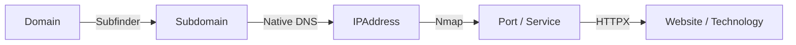
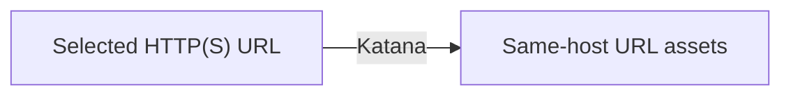
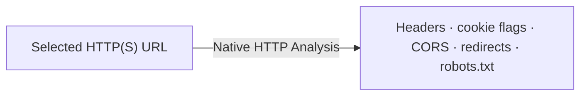
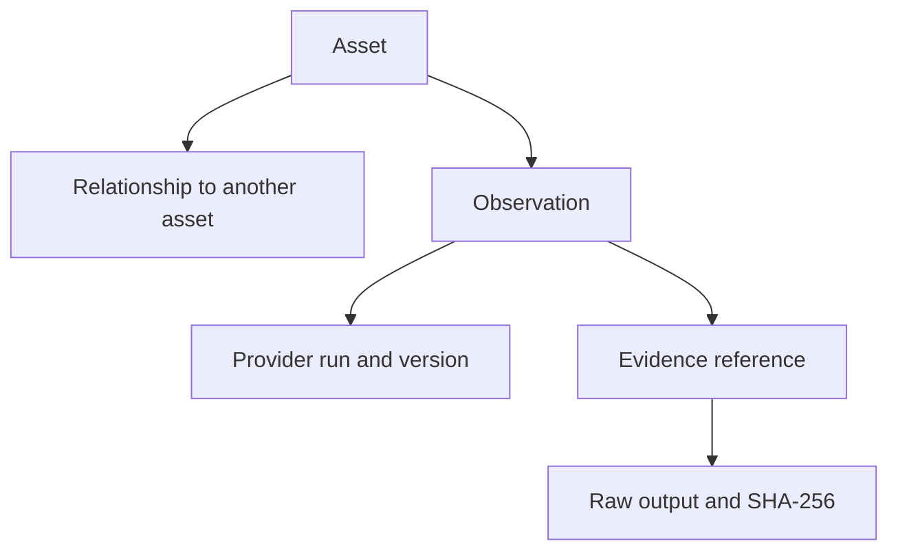
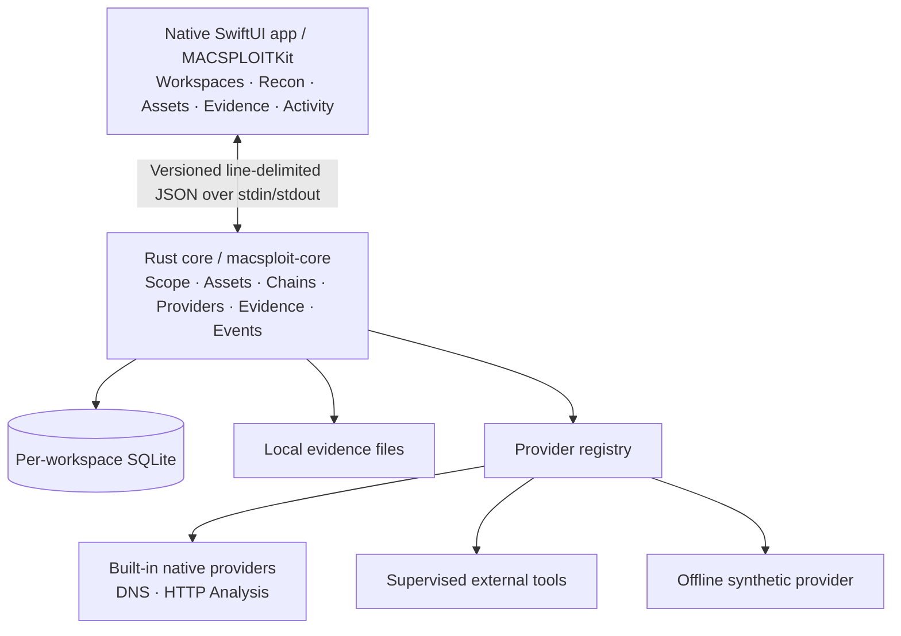

<table>
<tr>
<td width="60%" valign="middle">
<h1>MACSPLOIT</h1>
<h3>Separate tools. Connected evidence.<br>One native macOS workspace.</h3>
<p>Connect reconnaissance tools through persistent assets, relationships, and evidence. Keep scope part of every workflow.</p>
<p><strong>Public Beta</strong> · Open source · Authorized security research</p>
<p><sub>Pre-1.0 interfaces and provider contracts may change.</sub></p>
<p><a href="#quick-start"><strong>Try it offline →</strong></a> &nbsp; <a href="#workflows">Explore the workflows</a></p>
</td>
<td width="40%" valign="top" align="right">

<sub>Concept artwork</sub>
</td>
</tr>
</table>

[](https://github.com/doctordoomies/MACSPLOIT/actions/workflows/ci.yml) [](#build) [](#architecture) [](#architecture) [](LICENSE)

**[Overview](#overview) · [Workflows](#workflows) · [Providers](#providers) · [Architecture](#architecture) · [Quick start](#quick-start) · [Build](#build) · [Safety](#safety) · [Roadmap](#roadmap) · [Contributing](#contributing)**

## Overview

MACSPLOIT is a native macOS security workbench that turns separate reconnaissance tools into **one persistent, scope-aware asset and evidence system**. Discover subdomains, resolve addresses, identify services, probe websites, crawl URLs, and inspect HTTP security metadata. Inspect the relationships and the provider output behind each observation in the same workspace.

**Provider output is not the product.** A directory of Subfinder results, Nmap XML, HTTPX JSON, screenshots, and notes still leaves the analyst to reconstruct what belongs together. MACSPLOIT gives structured discoveries a shared model:

```text
Specialist providers → Normalized assets → Relationships + observations
                                                       ↓
                                          Evidence + provenance
                                                       ↓
                                           Persistent workspace
```

| Follow the asset | Inspect the evidence | Keep the context |
| --- | --- | --- |
| Deduplicated identities and explicit relationships connect discoveries. | Raw output is saved before parsing and verified with SHA-256 when read. | Scope, provider runs, observations, and activity survive core restarts. |

The app runs locally, with no telemetry or hosted assessment backend. Real providers make network requests when you launch their workflows; Synthetic Recon stays offline.

## Workflows

Four analysis modes are available today. Each uses the same core orchestration, evidence, and persistence system.

### Domain Recon

Start with an authorized domain. The chain discovers subdomains, resolves their addresses, scans in-scope IPs, and probes discovered HTTP services.



Subfinder, Nmap, and ProjectDiscovery HTTPX must be installed. DNS is built in. Nmap uses an unprivileged TCP-connect profile with service detection and the top 100 ports; no NSE scripts or root access. A hostname being in scope does **not** authorize scanning every IP it resolves to.

### Web Recon

Select an in-scope HTTP(S) URL and explicitly launch a separate crawl. Domain Recon does not automatically launch Katana.



Katana runs in standard, non-headless mode: depth **2**, a **20-second** crawl budget, a **5-second** request timeout, and bounded response/output sizes. Automatic form filling, authentication flows, and JavaScript crawling are not enabled. The parser accepts valid same-host URLs and drops duplicates and external-host results.

### Web Analysis

Select an explicitly in-scope HTTP(S) URL and run the built-in **Native HTTP Analysis** provider. It does not require Katana or another external HTTP-analysis executable.



The provider is `ACTIVE_LOW_IMPACT` and deliberately bounded. It accepts only HTTP/HTTPS targets, rejects credential-bearing URLs, keeps TLS validation enabled, caps response bodies at **256 KiB**, follows redirects itself, and scope-checks every redirect hop before continuing. Cookie **security attributes** are retained; cookie values are not persisted. The result enriches the Website asset through observations and hashed evidence rather than inventing asset types for individual headers or cookies.

### Synthetic Recon

Exercise the complete orchestration path using invented subdomains, documentation IP addresses, ports, and services. No scanner installation, DNS, or network requests are needed. [Try the offline walkthrough below.](#quick-start)

All four modes feed the **asset graph, evidence, observations, and durable events**, persisted in the local workspace and presented in SwiftUI. See [Recon Chains](docs/recon-chain.md) for stage behavior and failure handling.

## Assets with a history

An asset has a normalized identity. A relationship describes how it connects to another asset. An observation records what a provider reported, retaining its run and evidence reference. Repeated discoveries can reuse the asset while adding observations.



Current workflows produce **Subdomain, IPAddress, Port, Service, Website, Technology, and URL** assets; domain and URL targets seed their chains. Hostname is also supported by the model. Endpoint and Certificate are model types, not a claim that endpoint analysis or certificate collection is implemented. The asset graph here means persisted data and relationships, not a shipped interactive graph canvas.

### How a discovery flows

Illustrative values only; these are not live results or targets to scan:

```text
example.test
  └─ Subfinder → api.example.test
       └─ Native DNS → 192.0.2.42
            ├─ Nmap → 443/tcp → https service
            └─ HTTPX → https://192.0.2.42:443 → technology observations

Explicitly add/select https://192.0.2.42:443 as an in-scope URL target:
  ├─ Web Recon / Katana → https://192.0.2.42:443/swagger.json
  └─ Web Analysis / Native HTTP → headers · cookie flags · CORS · redirects · robots.txt
```

HTTPX currently builds probe URLs from IP-based service identities. A path such as `/swagger.json` is only discovered if the crawl actually returns it. Domain relationships and each run's evidence remain in the workspace; starting Web Recon or Web Analysis is an analyst action, not an automatic cross-chain handoff.

## Providers

| Provider | Capability | Type | Risk class | Normalized output |
| --- | --- | --- | --- | --- |
| **Synthetic** | Offline demonstration | Built in | `PASSIVE` · offline | Subdomains, IPs, ports, services |
| **Subfinder** | Subdomain discovery | External | `PASSIVE` | Subdomains |
| **Native DNS** | A/AAAA resolution | Built in | `ACTIVE_LOW_IMPACT` | IP addresses; `resolves_to` links |
| **Nmap** | Port/service discovery | External | `ACTIVE` | Ports and services; `exposes` / `serves` links |
| **HTTPX** | HTTP probing and basic technology detection | External | `ACTIVE_LOW_IMPACT` | Websites and technologies |
| **Katana** | Bounded same-host crawling | External | `ACTIVE_LOW_IMPACT` | URLs; `has_endpoint` links |
| **Native HTTP Analysis** | HTTP/security metadata analysis | Built in | `ACTIVE_LOW_IMPACT` | Website observations; headers, cookie flags, CORS, redirects, robots evidence |

The app surfaces provider availability, version, and risk. Stages select capabilities through an internal provider contract; SwiftUI never parses scanner output. Native HTTP Analysis is built in and runs independently of Katana. [Provider details](docs/providers.md) · [Installation](#external-providers)

## Evidence and provenance

> **Keep the original result, not just the parser's interpretation.**

```text
Provider execution → Captured output → Evidence + SHA-256 → Parser
                                                               ↓
                                                    Normalized discoveries
                                                               ↓
                                              Observations → evidence reference
```

The core writes the returned execution envelope **before parsing**: provider identity and detected version, command, timings, exit status, and captured stdout/stderr. Evidence stays available when a returned execution reports failure or its parser fails. This preserves the inputs needed to examine or reproduce an interpretation; it does not promise a changing target will return the same result twice.

Evidence is stored in the workspace and SHA-256 checked when opened. Asset observations link back to that evidence and provider run, making attribution inspectable rather than implicit. Evidence files are local and permission-restricted, **not encrypted**; broader redaction and retention controls remain future work.

## Architecture



| Component | Responsibility |
| --- | --- |
| **SwiftUI + MACSPLOITKit** | Native presentation, workspace navigation, recon controls, and typed core communication |
| **Rust core** | Classification, scope decisions, normalized assets, chain execution, parsing, evidence, and events |
| **SQLite + evidence files** | Durable workspace state, relationships, observations, run history, and original provider output |
| **Providers** | Specialized capabilities behind separate metadata, installation, execution, and parsing operations |

The app owns a bundled Rust helper communicating over anonymous pipes; there is no network listener or background service that survives app quit. External processes use executable paths and argument arrays, bounded output, deadlines, and process-group cancellation.

[Architecture](docs/architecture.md) · [Internal protocol](schemas/internal-protocol-v1.md) · [Provider development](docs/provider-development.md)

## Safety

**Discovery does not equal authorization.** Scope is part of dispatch, not just a label on a result.

```text
Discovery → Scope check → Provider risk policy → Allowed or denied dispatch
```

Exact host rules, wildcard label boundaries, and IPv4/IPv6 CIDRs determine scope. Out-of-scope assets are not silently fed into active providers. In particular, DNS results are checked independently before Nmap runs, even when the parent domain is authorized.

`PASSIVE` and `ACTIVE_LOW_IMPACT` providers run on in-scope targets. Launching Domain Recon explicitly authorizes its `ACTIVE` stage, still subject to per-asset scope checks. `VALIDATION` and `LAB_ONLY` are defined risk classes but rejected by current reconnaissance execution.

Use MACSPLOIT only on systems you own or are explicitly authorized to assess. The development app runs as your user, is unsandboxed and ad-hoc signed, and is not notarized. [Security model](docs/security-model.md) · [Threat model](docs/threat-model.md)

### What MACSPLOIT is not

MACSPLOIT is not an automatic exploitation framework, a replacement for every specialist tool, or a cloud service that uploads your assessments. Its role goes beyond launching shell commands: it organizes and correlates specialist tools in a local workbench.

## Quick start

### Try MACSPLOIT without touching the network

[Build and launch the app](#build), then use **Synthetic Recon**. No external providers are required for this walkthrough.

```text
Workspace   Test Assessment
Target      example.test
Scope       example.test
            *.example.test
            192.0.2.0/24
```

1. Create **Test Assessment**, keeping the suggested scope entries above, one per line.
2. Add `example.test` in the target bar; it should classify as **Domain**.
3. Open **Recon**, select **Synthetic Recon** and the target, then click **Run**.
4. Inspect **Assets** and their relationships/observations. Open linked **Evidence** to read verified JSON, and **Activity** to see persisted events. Recon retains stage status and run history.
5. Quit and reopen the app. The workspace and results should remain; repeat the run to add observations without duplicating normalized assets.

The first complete synthetic run produces **11 assets, 10 relationships, and 3 evidence records**. Automated bridge tests cover core shutdown/restart persistence. The full on-screen quit/reopen acceptance walkthrough is still pending; see the [verification record](docs/phase-0-verification.md).

## Build

### Required development tools

| Requirement | Details |
| --- | --- |
| **macOS** | App deployment target: **13+**. The verified Swift Testing runtime requires **14+** to run the test suite. |
| **Swift** | **6+**, supplied by Xcode or Apple Command Line Tools; scripts use SwiftPM |
| **Rust + Cargo** | Stable, **1.90+** baseline for the committed dependency lock |
| **Git + Python** | Git for the checkout; **Python 3.10+** for repository hooks and policy tests |
| **GitHub CLI** | Authenticated `gh` is needed for destination verification when pushing, not to launch the app |

Apple Silicon is the primary verified target. Intel builds and older supported macOS versions need separate verification. Initial dependency downloads need network access; automated provider tests use offline fixtures.

```sh
git clone https://github.com/doctordoomies/MACSPLOIT.git
cd MACSPLOIT

./scripts/setup-hooks.sh
./scripts/test.sh
./scripts/build-macos.sh
open build/MACSPLOIT.app
```

For later development launches, `./scripts/run.sh` builds and opens the app. The build script bundles the Rust helper and ad-hoc signs `build/MACSPLOIT.app`. See [development setup](docs/development.md) for toolchain details.

Workspace databases and evidence default to `~/Library/Application Support/MACSPLOIT/`, outside the checkout. Build artifacts stay in ignored directories. No external scanner is required to build, launch, or run Synthetic Recon.

### External providers

Install only the tools needed for the workflows you intend to run. MACSPLOIT detects providers but **does not silently install them**. Synthetic Recon, Native DNS, and Native HTTP Analysis require nothing extra.

| Workflow | Optional installation commands | Homebrew formula reference |
| --- | --- | --- |
| Domain Recon | `brew install subfinder nmap httpx` | [Subfinder](https://formulae.brew.sh/formula/subfinder) · [Nmap](https://formulae.brew.sh/formula/nmap) · [HTTPX](https://formulae.brew.sh/formula/httpx) |
| Web Recon | `brew install katana` | [Katana](https://formulae.brew.sh/formula/katana) |
| Web Analysis | None — built in | Native provider |

HTTPX here is **ProjectDiscovery's CLI**, not the Python HTTP client. Formula availability and OS support follow Homebrew's current support policy. For executable discovery and explicit path overrides, see [providers](docs/providers.md).

## Roadmap

Build a useful baseline across workbench categories, then deepen provider coverage. **Implemented, planned, and future are distinct:** the [feature matrix](docs/features.md) is authoritative.

| Area | State | What that means today |
| --- | --- | --- |
| Workspaces, scope, asset model, evidence, events | **STABLE** | Implemented persistent foundation |
| Synthetic Recon | **STABLE** | Full offline demonstration |
| Domain Recon providers | **BETA** | Subfinder → DNS → Nmap → HTTPX |
| Web Recon | **BETA** | Bounded Katana crawling |
| Native HTTP Analysis | **BETA** | Built-in headers, cookie flags, CORS, redirects, and robots analysis |
| Technology detection | **BETA** | Basic HTTPX fingerprints |
| JavaScript analysis | **PLANNED** | Deeper web analysis |
| Content discovery and historical URLs | **PLANNED** | Explicit ffuf stage; historical URL collection |
| API discovery and screenshots | **PLANNED** | Web reconnaissance expansion |
| TLS, vulnerability assessment, findings | **PLANNED** | Conservative detection and evidence-backed correlation |
| OSINT | **PLANNED** | Username, email, phone, and domain research |
| Reporting and Tool Manager | **PLANNED** | Exports and provider management |
| Provider SDK | **EXPERIMENTAL** | Documented internal trait; no stable public plugin ABI |
| Source/secret analysis, cloud/containers | **FUTURE** | Outside the current implementation |
| Authorized lab, hardware, wireless | **FUTURE** | Separate from normal reconnaissance |

The next documented breadth step is **Phase 2C — explicit, bounded Content Discovery**, followed by historical URL intelligence and JavaScript analysis. The broader sequence then continues through **vulnerability assessment → OSINT → reporting → provider SDK**. These are development directions, not release dates. See the [full roadmap](docs/roadmap.md) and [changelog](CHANGELOG.md).

## Contributing

Help improve a provider or parser, refine normalized asset modeling, polish SwiftUI, add offline fixtures, clarify documentation, or review a security boundary. Start with the [contributing guide](CONTRIBUTING.md), [provider development guide](docs/provider-development.md), [architecture](docs/architecture.md), and [security model](docs/security-model.md).

**Automated security-provider tests must use fixtures, synthetic data, or fake executables.** Keep real assessment data and secrets out of code, tests, issues, and pull requests.

## Security reporting

For a vulnerability **in MACSPLOIT**, use [GitHub private vulnerability reporting](https://github.com/doctordoomies/MACSPLOIT/security/advisories/new) and follow [SECURITY.md](SECURITY.md). Do not open a public issue for an undisclosed vulnerability.

Findings produced while assessing another system belong with that system's authorized reporting process, not the MACSPLOIT issue tracker.

## License

Open source under the [Apache License 2.0](LICENSE).

---

**MACSPLOIT** · Separate tools. Connected evidence. One workspace.
