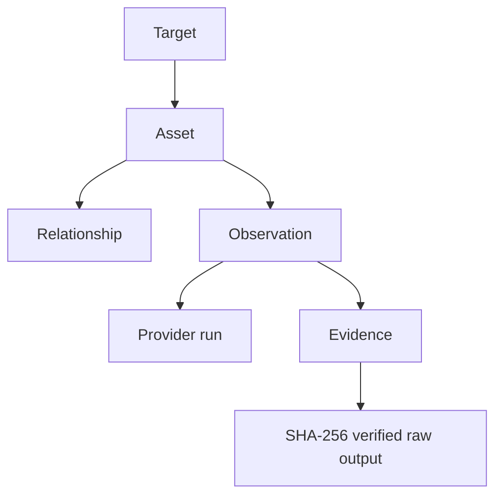
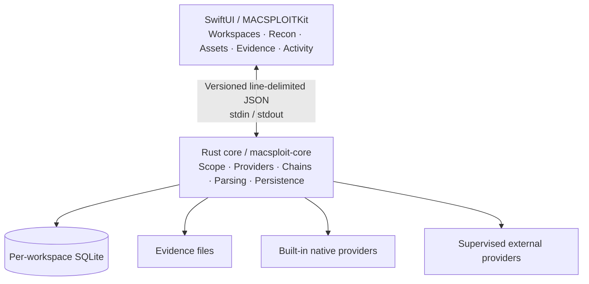

<div align="center">


# MACSPLOIT

### A native macOS security workbench for turning recon tools into connected, reviewable evidence.

**SwiftUI interface · Rust core · Local-first · Scope-aware · Open source**

[](https://github.com/doctordoomies/MACSPLOIT/actions/workflows/ci.yml)
[](https://github.com/doctordoomies/MACSPLOIT/actions/workflows/codeql.yml)


[](LICENSE)

**Public Beta** · Pre-1.0 · Native macOS security tooling

[Quick start](#quick-start) · [What works today](#what-works-today) · [Architecture](#architecture) · [Contributing](#contributing) · [Roadmap](docs/roadmap.md)

</div>

---

## What is MACSPLOIT?

MACSPLOIT is a native macOS security workbench that connects specialist reconnaissance tools through a shared model of **targets, assets, relationships, observations, evidence, and provider runs**.

| 🧭 Connected recon | 🔐 Evidence-first | 🧩 Provider-based | 🖥️ Native macOS |
| --- | --- | --- | --- |
| Findings from different tools live in one workspace. | Raw provider output stays linked to normalized results. | Built-in and external capabilities share one model. | SwiftUI front end with a Rust core. |

Instead of ending a scan with five terminals and a folder full of unrelated output, MACSPLOIT keeps the context together:

```text
Authorized target
      ↓
Specialist provider
      ↓
Normalized discoveries
      ↓
Assets + relationships + observations
      ↓
Evidence + provenance
      ↓
Persistent local workspace
```

The goal is not to replace tools like Nmap, Subfinder, HTTPX, Katana, or ffuf. The goal is to make them work like parts of one coherent application.

> [!NOTE]
>
> **Provider output is not the product.** The useful part is understanding what was discovered, how it connects, which provider produced it, and where the original evidence came from.

MACSPLOIT runs locally on your Mac. There is no hosted assessment backend and no telemetry pipeline.

---

## Why build this?

Security reconnaissance is powerful, but the workflow is often fragmented:

- one tool discovers subdomains;
- another resolves them;
- another scans ports;
- another probes HTTP services;
- another crawls URLs;
- output formats differ;
- provenance gets lost;
- scope decisions live in the analyst's head;
- revisiting a run means reconstructing what happened.

MACSPLOIT is built around a different idea:

| Principle | What it means in practice |
| --- | --- |
| **Scope is part of execution** | Active providers are dispatched only against assets the Rust core considers authorized. |
| **Evidence first** | Provider output is captured and hashed before interpretation. |
| **Normalized discoveries** | Repeated observations can reuse the same asset instead of creating disconnected records. |
| **Provenance stays attached** | Observations retain provider-run and evidence references. |
| **Local first** | Workspaces, SQLite state, and evidence remain on the Mac. |
| **Explicit automation** | Recon stages do not silently launch unrelated follow-up workflows. |
| **Bounded behavior** | Provider runtimes, output size, crawl depth, rates, and parsing are intentionally constrained. |

---

## What works today

MACSPLOIT is under active development, but the current beta already supports real workflows.

> [!TIP]
>
> **Want to see the whole workbench without touching the network?** Start with **Synthetic Recon**. It exercises the orchestration, Assets, relationships, Evidence, Activity, and persistence path using invented targets only.

| Workflow | Input | Provider(s) | Current behavior |
| --- | --- | --- | --- |
| **Synthetic Recon** | Demo domain | Built in | Fully offline end-to-end demonstration |
| **DNS Recon** | Domain, hostname, IP, URL | Native DNS | A/AAAA forward lookup and PTR reverse lookup |
| **Domain Recon** | Domain | Subfinder → Native DNS → Nmap → HTTPX | Subdomains, IPs, ports, services, websites, technologies |
| **IP Recon** | IPv4 / IPv6 | Nmap → HTTPX | Direct port/service and HTTP discovery |
| **Web Analysis** | HTTP(S) URL | Native HTTP Analysis | Headers, cookie security flags, CORS, redirects, robots metadata |
| **Web Recon** | HTTP(S) URL | Katana | Bounded same-host URL discovery |
| **Content Discovery** | HTTP(S) URL | ffuf | Bounded same-host path discovery using a user-selected wordlist |

### Core workbench

- persistent workspaces;
- editable authorization scope;
- normalized assets and relationships;
- provider runs and observations;
- original Evidence with SHA-256 verification;
- activity/event history;
- provider readiness and version detection;
- explicit provider installation;
- guided first-run setup;
- local/private target support;
- IPv4, IPv6, localhost, private URLs, and custom ports;
- cancellation and bounded provider execution.

### Provider installation

Provider Center can detect missing tools and offer supported install methods.

For **Subfinder, HTTPX, Katana, and ffuf**, MACSPLOIT supports Homebrew or an app-managed install. **Nmap** remains Homebrew / official-installer only.

See [provider documentation](docs/providers.md) for installation behavior and implementation details.

---

## The asset and evidence model

Every useful result should have context.

> [!NOTE]
>
> **Assets and observations are intentionally different.** An asset represents normalized identity; observations record what a provider reported during a particular run. Repeated discoveries can therefore add history without duplicating the asset.



Current workflows can produce:

- Subdomain
- Hostname
- IPAddress
- Port
- Service
- Website
- Technology
- URL

Examples of relationships include:

- `has_subdomain`
- `resolves_to`
- `ptr_record`
- `exposes`
- `serves`
- `has_endpoint`
- `uses_technology`

This lets MACSPLOIT preserve a chain such as:

```text
example.test
└─ api.example.test
   └─ 192.0.2.42
      ├─ 443/tcp
      │  └─ HTTPS
      └─ https://192.0.2.42:443
         └─ nginx
```

without treating those discoveries as unrelated lines of scanner output.

---

## Architecture

MACSPLOIT keeps presentation and core execution concerns separated.

> [!NOTE]
>
> **SwiftUI does not parse scanner output.** Provider execution, parsing, normalization, persistence, and Evidence handling stay behind the Rust core boundary.



### SwiftUI

Responsible for presentation, navigation, workflow controls, setup, provider management, and typed communication with the core.

### Rust core

Authoritative for:

- target classification;
- scope decisions;
- risk policy;
- process supervision;
- provider execution;
- parser bounds;
- normalized assets and relationships;
- observations and evidence;
- persistent chain state.

### External tools

External providers are launched with executable paths and argument arrays—not shell command strings—and run through a bounded process supervisor with deadlines, output limits, and process-group cancellation.

Deep dives:

- [Architecture](docs/architecture.md)
- [Security model](docs/security-model.md)
- [Threat model](docs/threat-model.md)
- [Recon chains](docs/recon-chain.md)
- [Internal protocol](schemas/internal-protocol-v1.md)
- [Provider development](docs/provider-development.md)

---

## Quick start

### Option 1 — Try the complete workflow offline

> [!TIP]
>
> **This is the recommended first run.** No external scanner, DNS lookup, or network request is required.

Build and launch the app, create a workspace, then use:

```text
Workspace   Test Assessment
Target      example.test
Scope       example.test
            *.example.test
            192.0.2.0/24
```

Open **Recon → Synthetic Recon → Run**.

Then inspect:

1. **Assets** — normalized discoveries and relationships;
2. **Evidence** — the original provider output;
3. **Activity** — durable execution events;
4. the selected run's stage history.

Synthetic Recon uses invented domains and documentation IP ranges only.

### Option 2 — Run a built-in real workflow

> [!NOTE]
>
> **DNS Recon** and **Web Analysis** are built in, so you can try live workflows before installing any external provider.

For example:

1. Create a workspace.
2. Add the target and workspace scope.
3. Open **Recon → DNS Recon**.
4. Run the workflow.
5. Inspect the resulting Assets and Evidence.

### Option 3 — Test a local app

> [!TIP]
>
> Developing a web app locally? You can point MACSPLOIT directly at `localhost`, loopback, private IPs, custom ports, or development hostnames.

MACSPLOIT works with local and private targets without public DNS.

```text
Scope    localhost
Target   http://localhost:3000
```

You can then explicitly run Web Analysis, Web Recon, or Content Discovery as appropriate.


---

## Build from source

### Requirements

| Requirement | Baseline |
| --- | --- |
| macOS | App deployment target: **13+** |
| Swift | **6+** |
| Rust | Stable, **1.90+** |
| Python | **3.10+** for repository policy tests |
| Git | Required |
| GitHub CLI | Required only for push/destination verification |

> [!NOTE]
>
> **Apple Silicon is the primary verified target.** Intel builds and older supported macOS versions may work, but they need separate verification.

```sh
git clone https://github.com/doctordoomies/MACSPLOIT.git
cd MACSPLOIT

./scripts/setup-hooks.sh
./scripts/test.sh
./scripts/build-macos.sh

open build/MACSPLOIT.app
```

For later development launches:

```sh
./scripts/run.sh
```

The build script bundles the Rust helper into the app and ad-hoc signs the development build.

Workspace data defaults to:

```text
~/Library/Application Support/MACSPLOIT/
```

See [development setup](docs/development.md) for the full environment.

---

## External providers

> [!TIP]
>
> You do **not** need every external provider to use MACSPLOIT. Synthetic Recon, DNS Recon, and Native HTTP Analysis work without them.

Install only what you need.

| Workflow | External requirements |
| --- | --- |
| Synthetic Recon | None |
| DNS Recon | None |
| Web Analysis | None |
| Domain Recon | Subfinder, Nmap, HTTPX |
| IP Recon | Nmap, HTTPX |
| Web Recon | Katana |
| Content Discovery | ffuf |

Provider Center can detect versions and supported install methods.

HTTPX refers to **ProjectDiscovery HTTPX**, not the Python HTTP client.

---

## Security model

MACSPLOIT's scope, provider risk, evidence, process, and threat boundaries are documented separately so the README can stay focused on the product.

- [Security model](docs/security-model.md)
- [Threat model](docs/threat-model.md)
- [Security reporting](SECURITY.md)

---

## Project status

> [!WARNING]
>
> MACSPLOIT is **public beta / pre-1.0**. Current workflows are real and tested, but provider contracts, internal protocol details, and parts of the UI can still change before a stable release.

That means:

- the architecture is real and actively tested;
- workspaces/evidence are persistent;
- current recon providers are functional;
- provider and protocol contracts may still change;
- UI/UX is still being refined;
- features marked planned or future are not implied to exist.

The current product focus is making real-target workflows easier to understand after execution—especially clear, run-specific Results and final real-target acceptance—before advancing into the later Findings/vulnerability-analysis milestones.

For the source of truth, see:

- [Roadmap](docs/roadmap.md)
- [Feature matrix](docs/features.md)
- [Changelog](CHANGELOG.md)

---

## Contributing

Contributions are welcome, especially from people interested in **Rust, Swift/SwiftUI, macOS development, security tooling, parser hardening, testing, and technical documentation**.

> [!TIP]
>
> **You do not need to add a whole new scanner to contribute.** Focused UI fixes, parser edge cases, offline fixtures, documentation, migration tests, accessibility work, and security review are all useful.

### Good ways to help

| Area | Example contributions |
| --- | --- |
| **SwiftUI / UX** | Workbench polish, accessibility, result presentation, responsive layouts |
| **Rust core** | Persistence, typed APIs, parser bounds, process supervision, tests |
| **Providers** | New integrations or improvements to existing provider normalization |
| **Security review** | Scope boundaries, evidence handling, installer hardening, protocol review |
| **Testing** | Offline fixtures, malformed-output cases, migration tests, Swift bridge tests |
| **Docs** | Provider guides, diagrams, tutorials, troubleshooting, screenshots |

### Start here

1. Read [CONTRIBUTING.md](CONTRIBUTING.md).
2. Skim the [architecture](docs/architecture.md) and [security model](docs/security-model.md).
3. Check the [open issues](https://github.com/doctordoomies/MACSPLOIT/issues).
4. Comment on an issue before starting a large architectural change.
5. Keep automated security-tool tests offline.

A provider contribution should include its risk class, supported targets, scope behavior, machine-readable parsing, bounded execution, evidence handling, and offline fixtures.

> [!NOTE]
>
> New ideas are welcome, but MACSPLOIT follows a milestone roadmap. Opening an issue does not automatically make a feature the next implementation task.

---

## Repository map

```text
MACSPLOIT/
├── apps/macos/        SwiftUI application + MACSPLOITKit
├── core/              Rust core, persistence, providers, orchestration
├── providers/         Provider-related project assets/configuration
├── schemas/           Versioned internal protocol
├── fixtures/          Offline provider/test fixtures
├── tests/             Repository/integration tests
├── scripts/           Build, test, audit, and policy scripts
├── docs/              Architecture, roadmap, security, provider docs
└── assets/            README/project artwork
```

---

## Security reporting

For vulnerabilities in MACSPLOIT itself, see [SECURITY.md](SECURITY.md).

---

## License

MACSPLOIT is open source under the [Apache License 2.0](LICENSE).

---

<div align="center">

**Separate tools. Connected evidence. One native macOS workspace.**

Built in public at [doctordoomies/MACSPLOIT](https://github.com/doctordoomies/MACSPLOIT).

</div>